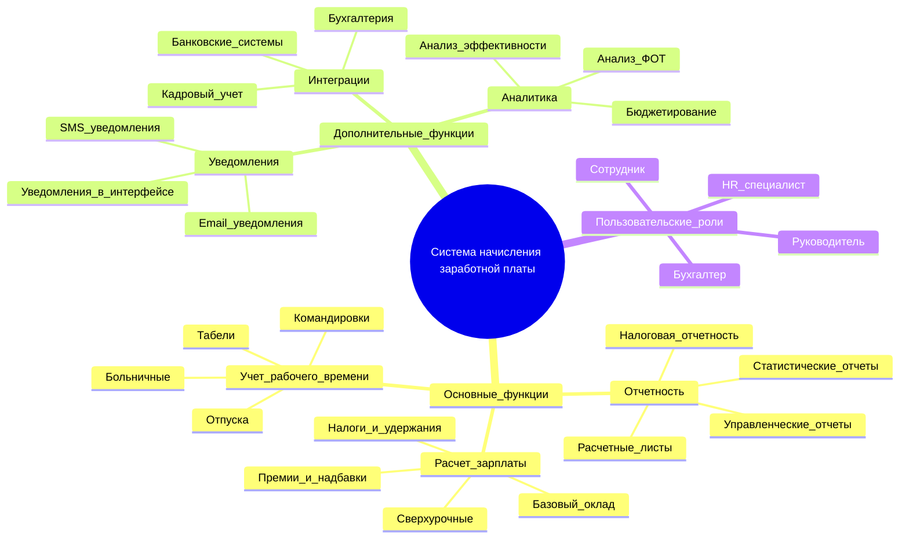
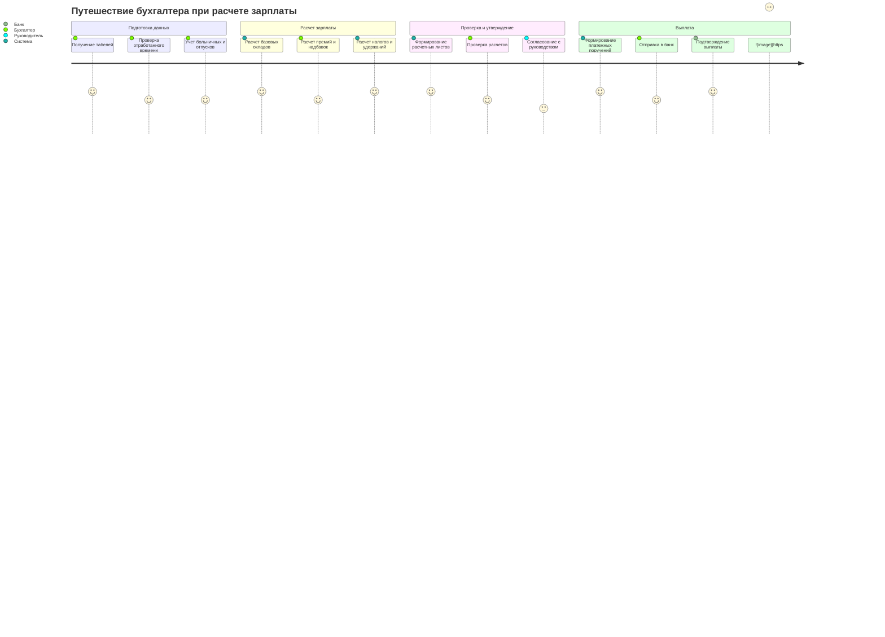

# ПКСС Практика 12
## Структура функциональных возможностей

```mermaid
mindmap
  root((Система начисления заработной платы))
    Основные_функции
      Расчет_зарплаты
        Базовый_оклад
        Премии_и_надбавки
        Налоги_и_удержания
        Сверхурочные
      Учет_рабочего_времени
        Табели
        Отпуска
        Больничные
        Командировки
      Отчетность
        Расчетные_листы
        Налоговая_отчетность
        Статистические_отчеты
        Управленческие_отчеты
    Дополнительные_функции
      Уведомления
        Email_уведомления
        SMS_уведомления
        Уведомления_в_интерфейсе
      Интеграции
        Банковские_системы
        Кадровый_учет
        Бухгалтерия
      Аналитика
        Анализ_ФОТ
        Анализ_эффективности
        Бюджетирование
    Пользовательские_роли
      Бухгалтер
      Руководитель
      Сотрудник
      HR_специалист
```
## Диаграмма путешествия пользователя

```mermaid
journey
  title Путешествие бухгалтера при расчете зарплаты
  section Подготовка данных
    Получение табелей: 5: Бухгалтер
    Проверка отработанного времени: 4: Бухгалтер
    Учет больничных и отпусков: 4: Бухгалтер
  section Расчет зарплаты
    Расчет базовых окладов: 5: Система
    Расчет премий и надбавок: 4: Бухгалтер
    Расчет налогов и удержаний: 5: Система
  section Проверка и утверждение
    Формирование расчетных листов: 5: Система
    Проверка расчетов: 4: Бухгалтер
    Согласование с руководством: 3: Руководитель
  section Выплата
    Формирование платежных поручений: 5: Система
    Отправка в банк: 4: Бухгалтер
    Подтверждение выплаты: 5: Банк
![image](https://github.com/user-attachments/assets/0fc4a64c-ada3-40b0-a2c2-9b22e1f0f030)
```

