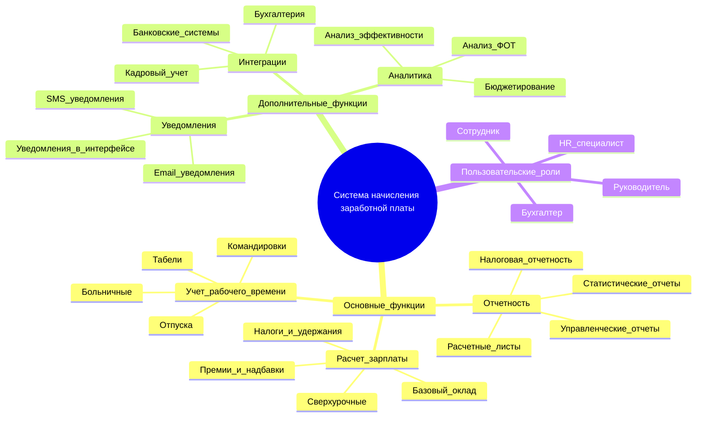
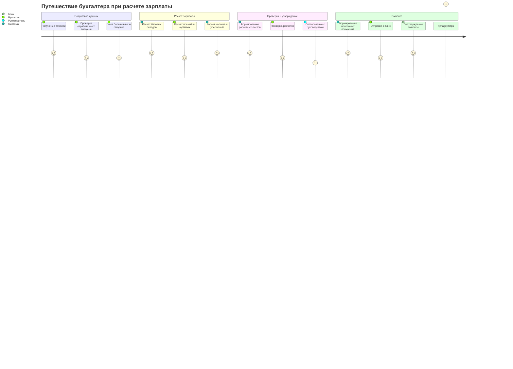
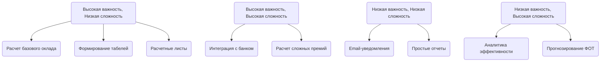

# ПКСС Практика 12
## Структура функциональных возможностей

## Диаграмма путешествия пользователя

## Квадрант-граф

## Git-граф
```mermaid
gitGraph
    commit id: "Initial commit"
    branch development
    commit id: "Базовая структура проекта"
    commit id: "Модуль расчета оклада"
    branch feature/timesheet
    commit id: "Создание табеля учета времени"
    commit id: "Расчет отработанных часов"
    checkout development
    commit id: "Интерфейс бухгалтера"
    checkout feature/timesheet
    commit id: "Оптимизация расчетов"
    checkout development
    merge feature/timesheet id: "Слияние учета времени"
    branch feature/payments
    commit id: "Интеграция с банком"
    checkout development
    merge feature/payments id: "Слияние платежного модуля"
    branch feature/reports
    commit id: "Система отчетности"
    checkout development
    merge feature/reports id: "Слияние модуля отчетов"

